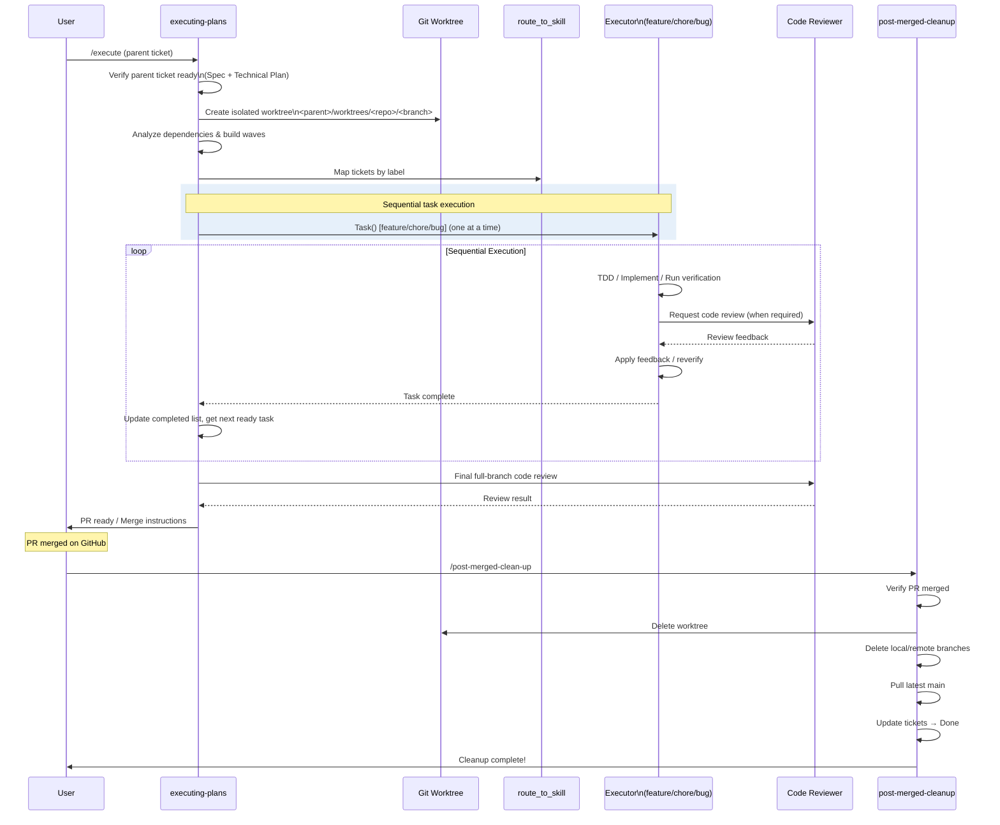

# plugin Execution Workflow


```mermaid
sequenceDiagram
    participant User
    participant Orchestrator as executing-plans
    participant Worktree as Git Worktree
    participant Router as route_to_skill
    participant Executor as Executor\n(feature/chore/bug)
    participant Reviewer as Code Reviewer
    participant Cleanup as post-merged-cleanup

    User->>Orchestrator: /execute (parent ticket)
    Orchestrator->>Orchestrator: Verify parent ticket ready\n(Spec + Technical Plan)
    Orchestrator->>Worktree: Create isolated worktree\n<parent>/worktrees/<repo>/<branch>
    Orchestrator->>Orchestrator: Analyze dependencies & build waves
    Orchestrator->>Router: Map tickets by label
    rect rgb(230,240,250)
        Note over Orchestrator,Executor: Sequential task execution
        Orchestrator->>Executor: Task() [feature/chore/bug] (one at a time)
    end
    loop Sequential Execution
        Executor->>Executor: TDD / Implement / Run verification
        Executor->>Reviewer: Request code review (when required)
        Reviewer-->>Executor: Review feedback
        Executor->>Executor: Apply feedback / reverify
        Executor-->>Orchestrator: Task complete
        Orchestrator->>Orchestrator: Update completed list, get next ready task
    end
    Orchestrator->>Reviewer: Final full-branch code review
    Reviewer-->>Orchestrator: Review result
    Orchestrator->>User: PR ready / Merge instructions
    Note over User: PR merged on GitHub
    User->>Cleanup: /post-merged-clean-up
    Cleanup->>Cleanup: Verify PR merged
    Cleanup->>Worktree: Delete worktree
    Cleanup->>Cleanup: Delete local/remote branches
    Cleanup->>Cleanup: Pull latest main
    Cleanup->>Cleanup: Update tickets → Done
    Cleanup->>User: Cleanup complete!
```

## Complete Workflow

```
/refine → /plan → /breakdown → /execute → /pr → /address-feedback → [PR merged] → /post-merged-clean-up
```
