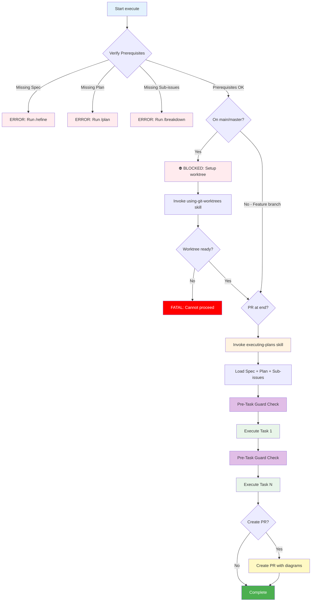

# Execute - Implementation Execution Command

Process sub-issues systematically with TDD workflow, automatic checks, and code review.

## Usage

```bash
/execute <issue-id>         # Execute implementation for parent issue
```

## Overview

Orchestrates the `executing-plans` skill to:

1. Verify prerequisites (Specification + Technical Plan + sub-issues exist)
2. Execute tasks with full context (WHAT + HOW + TDD checklist)
3. Automatic checks, code review, status updates
4. Create PR when complete (with user confirmation)

## Requirements

**Parent issue MUST have:**

- Specification section (from `/refine`)
- Technical Plan section (from `/plan`)
- Sub-issues (from `/breakdown`)

**Repository MUST have:**

- **Isolated git worktree** (MANDATORY - execution on main/master is blocked)
- Clean working directory
- Justfile with test/lint/format (recommended)

**⛔ CRITICAL: Execution will NOT proceed on main or master branch.**
The skill will automatically set up a worktree at `~/worktrees/{repo}/{branch}/` if needed.

## Workflow



**Note:** The "Pre-Task Guard Check" (purple) runs before EVERY task, even in resumed sessions.

## How It Works

### Step 1: Verify Prerequisites

**Read PM configuration from CLAUDE.md** and use `pm-operations` for all PM interactions:

```python
# FIRST: Check if on protected branch (BLOCKING)
# NOTE: run(cmd) is pseudocode for executing shell commands
current_branch = run("git branch --show-current")
if current_branch in ['main', 'master']:
    ERROR: """
    ⛔ BLOCKED: Cannot execute on {current_branch} branch

    Execution MUST happen in an isolated git worktree.
    Setting up worktree now...
    """
    # Invoke worktree skill
    Skill('devkit:using-git-worktrees')

    # Re-verify after setup
    new_branch = run("git branch --show-current")
    if new_branch in ['main', 'master']:
        FATAL: "Worktree setup failed. Cannot proceed."
        STOP

# Check working directory is clean
git_status = git status --porcelain
if git_status not empty:
    ERROR: Uncommitted changes
    SUGGEST: Commit or stash before continuing

# Load parent issue using configured PM system
parent = pm_operations.get_issue(id)

# Verify sections
if "## Specification" not in parent.description:
    ERROR: Run `/refine <issue-id>` first
if "## Technical Plan" not in parent.description:
    ERROR: Run `/plan <issue-id>` first

# Load sub-issues
sub_issues = pm_operations.list_children(parentId: parent.id)
if len(sub_issues) == 0:
    ERROR: Run `/breakdown <issue-id>` first
```

### Step 2: Invoke Executing-Plans Skill

```bash
Skill(devkit:executing-plans)
```

The skill handles PR confirmation, context extraction, subagent dispatch, checks, review, status updates, and PR creation. Respects already-completed sub-issues (allows resuming executions).

### Step 3: Subagent Context Template

Each subagent receives task description + relevant Specification excerpts (WHAT) + relevant Technical Plan guidance (HOW) + TDD checklist from sub-issue. They follow RED-GREEN-REFACTOR cycle, run checks, commit, and report.

## Error Handling

**Missing Prerequisites:** Run `/refine`, `/plan`, `/breakdown` in order before `/execute`.

**Dirty Working Directory:** Commit, stash, or use git worktree before executing.

**No Sub-Issues:** Run `/breakdown <issue-id>` to create implementation tasks first.

## Example

```bash
/execute AUTH-123

# Output:
# Loaded AUTH-123: "User authentication"
# ✓ Specification found
# ✓ Technical Plan found
# ✓ 18 sub-issues found
# Ready to start: 4 tasks (no dependencies)
# Using executing-plans skill...
# [Implementation with subagents]
# ✓ All 18 tasks complete
# ✓ 110 tests passing
# Create PR now? (yes/no)
# > yes
# ✓ PR created: https://github.com/org/repo/pull/145
```

## Integration

**Requires:** PM system configured (via `/setup`), parent issue with Specification + Technical Plan + sub-issues, `executing-plans` skill, `creating-pull-requests` skill, GitHub CLI authenticated.

**Uses:** Subagents for implementation, code review per task, automatic status updates, PR creation with diagrams.

## Remember

- **NEVER execute on main/master** - Worktree is mandatory
- **Pre-Task Guard protects resumed sessions** - Checks branch before every task
- Command verifies prerequisites, skill does execution
- Subagents get full context (WHAT + HOW + TDD checklist)
- Tests and implementation together (not split)
- Clean working directory required
- Respects completed sub-issues (resumable)

## Session Resumption

When a session is resumed (after context overflow or returning later), the Pre-Task Guard
in the skill will automatically verify git state and block if on main/master. This ensures
safety even when the original Step 1 checks were lost due to session boundaries.
