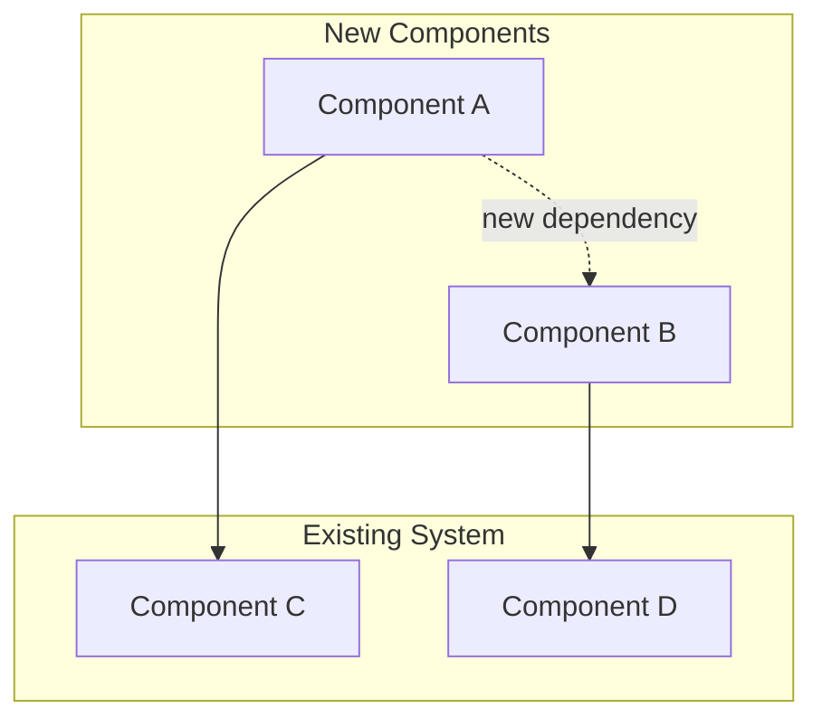
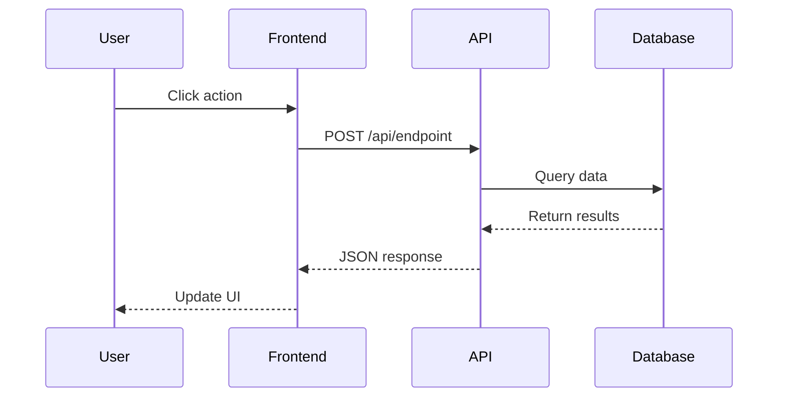
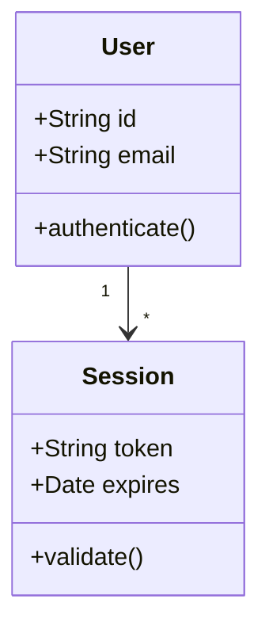
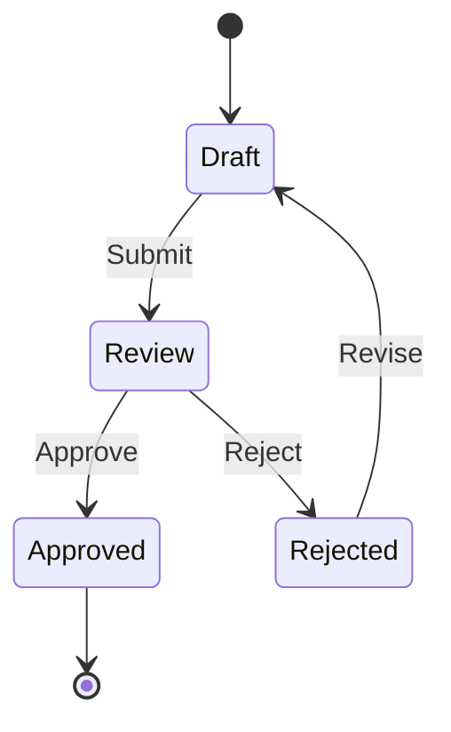
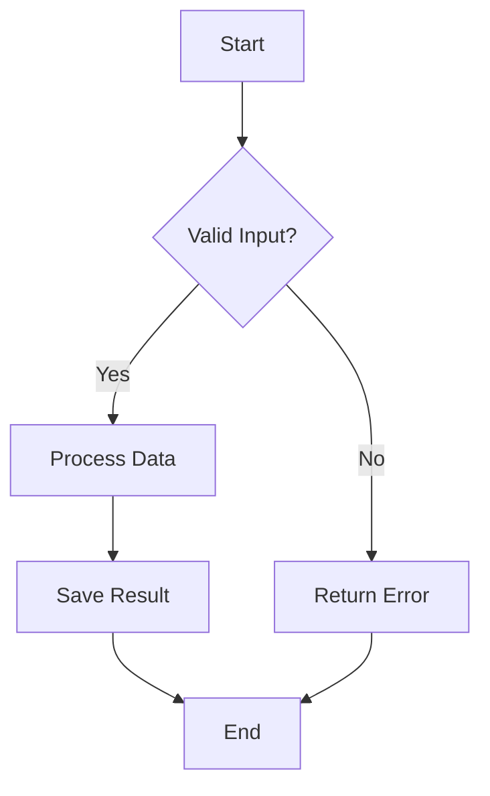
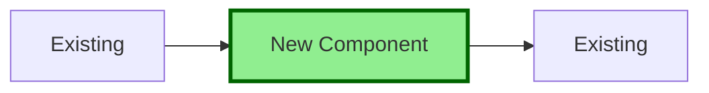
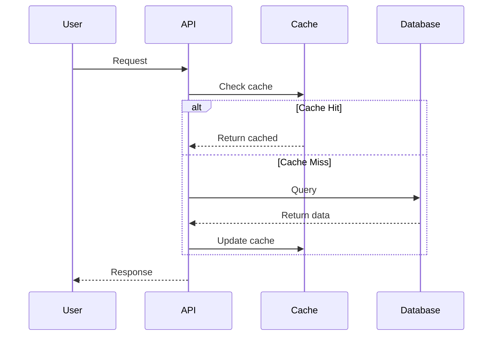

# Diagram Guide for Pull Requests

## When to Use Each Diagram Type

### Architecture Diagram (graph TB/LR)

Use for:

- New services or modules
- Component relationships
- System integration
- Dependency changes

Example:

### Sequence Diagram

Use for:

- API workflows
- User interactions
- Multi-step processes
- Event flows

Example:

### Class Diagram

Use for:

- Data model changes
- New classes/interfaces
- Inheritance hierarchies
- Relationships

Example:

### State Diagram

Use for:

- Status workflows
- FSM implementations
- Lifecycle changes

Example:

### Flowchart

Use for:

- Decision logic
- Algorithm changes
- Process flows

Example:

## Diagram Best Practices

1. **Keep it simple** - Show only what changed or is relevant
2. **Use clear labels** - Descriptive names for nodes and edges
3. **Highlight changes** - Use styling to show what's new
4. **Add context** - Include existing components for reference
5. **Multiple diagrams** - Break complex systems into multiple focused diagrams

## Advanced Styling

### Highlighting New Components

### Showing Optional Flows

## When to Include Diagrams

**Always include diagrams for:**

- Architecture changes - Show new components and relationships
- Complex workflows - Illustrate multi-step processes
- Data model changes - Show schema relationships
- State machines - Depict state transitions
- Integration points - Show how systems connect

**Skip diagrams for:**

- Simple bug fixes (unless workflow changed)
- Documentation-only changes
- Dependency version bumps
- Minor refactoring without structural changes
