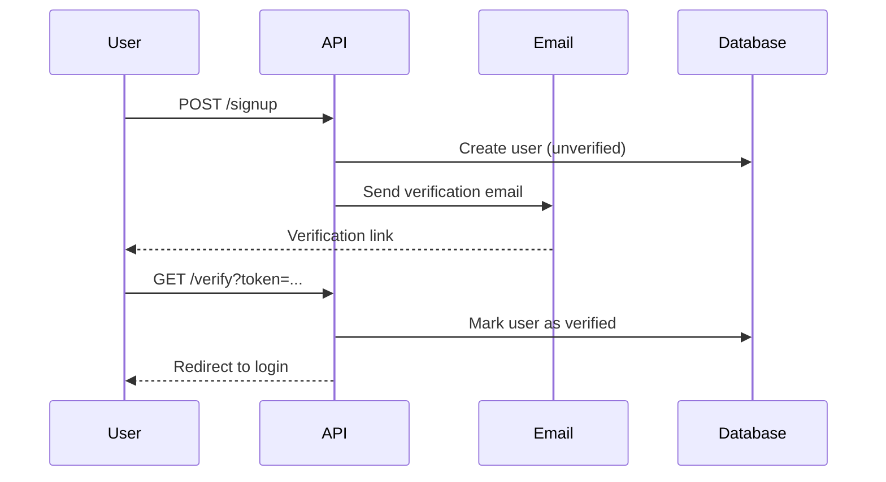
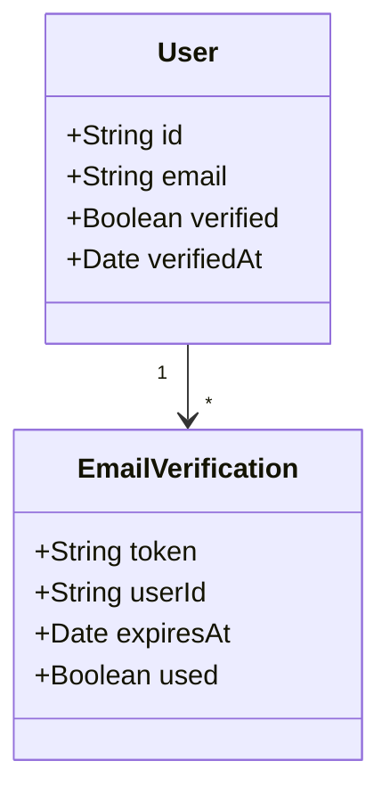
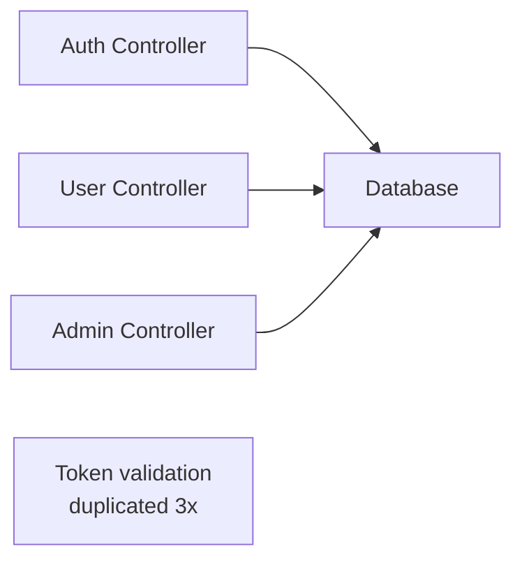
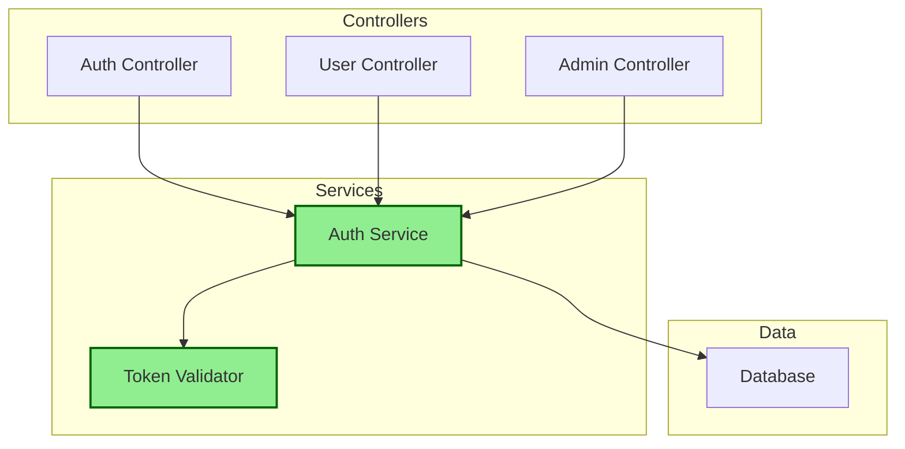
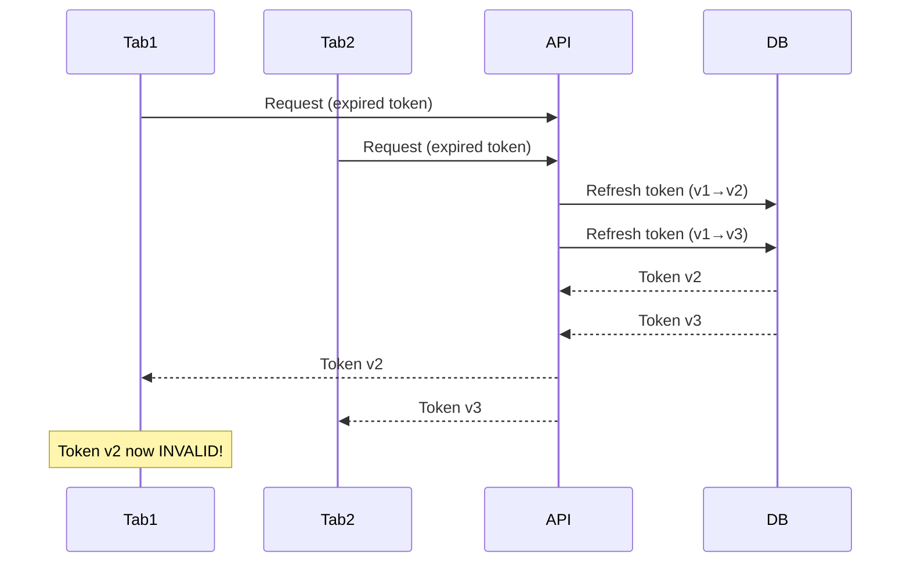
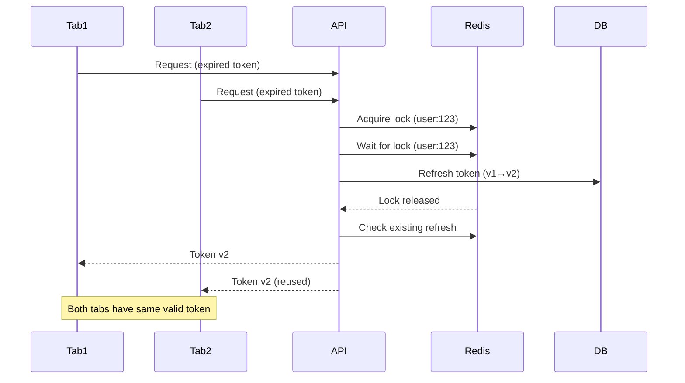
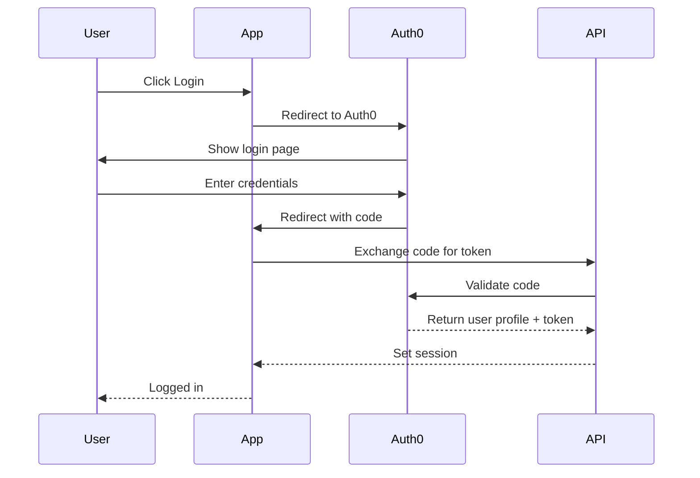

# Complete PR Examples

## Example 1: Simple Feature PR

```markdown
# feat: Add email verification

## Summary

Implements email verification workflow for new user registrations. Users receive a verification email upon signup and must verify before accessing the application.

## What Changed

### Features
- Email verification token generation and validation
- Verification email template and sending
- User verification status tracking
- Resend verification email endpoint

### Technical Changes
- New `EmailVerification` model and database table
- `EmailService` for sending verification emails
- Middleware to check verification status
- Email templates using Handlebars

## Visual Overview

### User Flow



```

### Data Model



```

## Implementation Details

### Key Files Changed

- `src/models/EmailVerification.ts` - New model for verification tokens
- `src/services/EmailService.ts` - Email sending functionality
- `src/controllers/AuthController.ts` - Added verification endpoints
- `src/middleware/requireVerified.ts` - New middleware to check status

### New Dependencies

- `nodemailer`: Email sending library
- `handlebars`: Email template rendering

## Testing

### Test Coverage

- 12 new tests added
- 3 existing tests updated
- All tests passing: ✅

### Test Strategy

- Unit tests for EmailService
- Integration tests for verification flow
- Edge case tests for expired tokens

## Related Issues

Closes #AUTH-45

---

🤖 Generated with [Claude Code](https://claude.com/claude-code)

```

## Example 2: Complex Refactoring PR

```markdown
# refactor: Extract authentication to service layer

## Summary

Refactors authentication logic from controllers into dedicated service layer. Improves testability, reduces code duplication, and prepares codebase for OAuth integration in future.

## What Changed

### Refactoring
- Extracted auth logic to `AuthService`
- Created `TokenValidator` utility class
- Unified error handling across auth endpoints
- Removed duplicate token validation code

### Architecture Improvements
- Clear separation of concerns (controller → service → data)
- Easier to mock for testing
- Single source of truth for auth rules

## Visual Overview

### Before Architecture



```

### After Architecture



```

## Implementation Details

### Key Files Changed

- `src/services/AuthService.ts` - **NEW** - Centralized auth logic
- `src/utils/TokenValidator.ts` - **NEW** - Token validation utilities
- `src/controllers/AuthController.ts` - Refactored to use service
- `src/controllers/UserController.ts` - Removed inline auth logic
- `src/controllers/AdminController.ts` - Removed inline auth logic

### Breaking Changes

None - This is a pure refactoring with same external API.

### Code Quality Improvements

- Reduced cyclomatic complexity in controllers
- Eliminated 150 lines of duplicate code
- Increased test coverage from 65% to 92% in auth module

## Testing

### Test Coverage

- 18 new service layer tests
- 12 existing controller tests updated
- 8 integration tests updated
- All tests passing: ✅

### Test Strategy

- Mocked service layer for controller tests
- Comprehensive service layer unit tests
- Integration tests verify end-to-end flows
- No behavioral changes detected

## Related Issues

Implements #TECH-89

---

🤖 Generated with [Claude Code](https://claude.com/claude-code)

```

## Example 3: Bug Fix PR

```markdown
# fix: Resolve race condition in token refresh

## Summary

Fixes race condition where concurrent requests could cause multiple token refreshes, invalidating all but the last. Now uses atomic operations with Redis lock to ensure single refresh per user.

## Bug Details

### Issue
When user had two tabs open and both requests hit expired token simultaneously:
1. Request A starts refresh
2. Request B starts refresh (doesn't see A's in-progress)
3. Request A completes, issues token v2
4. Request B completes, issues token v3
5. Token v2 immediately invalid
6. User sees "Session expired" error on first tab

### Root Cause
No synchronization mechanism for concurrent refresh attempts. Each request independently checked token status and started refresh.

## Solution

Implemented distributed lock using Redis:
1. Acquire lock with user ID key
2. Check if another refresh completed while waiting
3. If yes, return that token
4. If no, perform refresh
5. Release lock

## Visual Overview

### Before (Race Condition)



```

### After (With Lock)



```

## Implementation Details

### Key Files Changed

- `src/services/TokenService.ts` - Added distributed lock logic
- `src/utils/RedisLock.ts` - **NEW** - Lock implementation
- `src/middleware/authMiddleware.ts` - Updated to use new service method

### New Dependencies

- `ioredis` (^5.3.0): Redis client for distributed locking

### Configuration Changes

New environment variables required:
- `REDIS_URL` - Redis connection string (for lock storage)
- `TOKEN_REFRESH_LOCK_TTL` - Lock timeout in seconds (default: 5)

## Testing

### Test Coverage

- 8 new tests for lock behavior
- 4 tests for race condition scenarios
- 2 integration tests with concurrent requests
- All tests passing: ✅

### Reproduction Test

Added test that reproduces original bug:

```javascript
test('concurrent token refresh returns same token', async () => {
  // Simulate 10 concurrent refresh requests
  const promises = Array(10).fill(null).map(() =>
    refreshToken(userId)
  );

  const results = await Promise.all(promises);

  // All should return same token
  const uniqueTokens = new Set(results);
  expect(uniqueTokens.size).toBe(1);
});
```

Test FAILS on old code, PASSES on new code.

## Related Issues

Fixes #BUG-156
Related to #INCIDENT-89 (production outage caused by this)

---

🤖 Generated with [Claude Code](https://claude.com/claude-code)

```

## Example 4: PR with Breaking Changes

```markdown
# feat: Migrate to new authentication API

## Summary

Replaces custom JWT auth with OAuth 2.0 using Auth0. Provides better security, SSO support, and reduces maintenance burden.

⚠️ **BREAKING CHANGE** - Requires migration for existing users.

## What Changed

### Features
- OAuth 2.0 authentication via Auth0
- SSO support (Google, GitHub, Microsoft)
- Improved security with managed auth provider
- MFA support out of box

### Breaking Changes

1. **Auth endpoints changed:**
   - OLD: `POST /api/auth/login`
   - NEW: `GET /api/auth/login` (redirects to Auth0)

2. **Token format changed:**
   - OLD: Custom JWT format
   - NEW: Auth0 JWT (different claims structure)

3. **User ID format changed:**
   - OLD: UUID v4
   - NEW: Auth0 user ID (format: `auth0|xxx`)

### Migration Required

Existing users must re-authenticate on first login after deployment. Their accounts will be automatically linked to Auth0 profiles.

## Visual Overview

### Authentication Flow



```

## Implementation Details

### Key Files Changed

- `src/auth/` - **REMOVED** - Old JWT auth implementation
- `src/services/Auth0Service.ts` - **NEW** - Auth0 integration
- `src/middleware/authMiddleware.ts` - Updated for Auth0 tokens
- `src/models/User.ts` - Added `auth0Id` field
- `migrations/20250104_add_auth0_id.sql` - Database migration

### New Dependencies

- `express-openid-connect` (^2.16.0): Auth0 Express SDK
- `auth0` (^4.0.0): Auth0 management API client

### Removed Dependencies

- `jsonwebtoken`: No longer needed (Auth0 provides tokens)
- `bcrypt`: No longer storing passwords locally

### Configuration Changes

**New environment variables:**
```bash
AUTH0_DOMAIN=your-tenant.auth0.com
AUTH0_CLIENT_ID=your-client-id
AUTH0_CLIENT_SECRET=your-client-secret
AUTH0_CALLBACK_URL=http://localhost:3000/callback
```

**Removed environment variables:**

```bash
JWT_SECRET  # No longer needed
JWT_EXPIRES_IN  # No longer needed
```

## Migration Guide

### For Developers

1. Update `.env` with Auth0 credentials
2. Run database migration: `npm run migrate`
3. Update frontend to use new auth endpoints
4. Test login flow in development

### For Users

No action required. On first login after upgrade:

1. Click login
2. Authenticate with Auth0 (can use existing email/password)
3. Account automatically linked

### Rollback Plan

If issues occur:

1. Revert deployment
2. Restore database backup (auth0_id column can remain, will be ignored)
3. Old JWT auth will work immediately

Migration is one-way for security reasons. Rolling forward is recommended over rollback.

## Testing

### Test Coverage

- 24 new tests for Auth0 integration
- 15 tests updated for new auth flow
- 8 integration tests for SSO flows
- All tests passing: ✅

### Manual Testing Checklist

- [x] Login with email/password
- [x] Login with Google
- [x] Login with GitHub
- [x] Logout
- [x] Existing user migration
- [x] New user signup
- [x] MFA flow (optional)
- [x] Token refresh
- [x] Session expiration

## Security Considerations

Improvements:

- Auth0 manages password security (no passwords stored locally)
- Built-in breach detection
- Automatic security updates from Auth0
- MFA support included

No regressions identified.

## Related Issues

Implements #FEAT-234
Closes #SECURITY-45

---

🤖 Generated with [Claude Code](https://claude.com/claude-code)

```

## Common Patterns Across Examples

1. **Clear summary** - What changed and why in 1-2 paragraphs
2. **Visual diagrams** - Mermaid diagrams for complex flows
3. **Categorized changes** - Features, fixes, technical changes
4. **Testing details** - What was tested and coverage
5. **Related issues** - Proper linking with Closes/Fixes/Implements
6. **Claude Code attribution** - Footer acknowledgment
