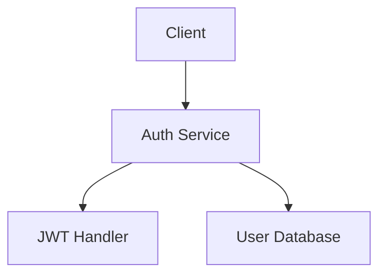
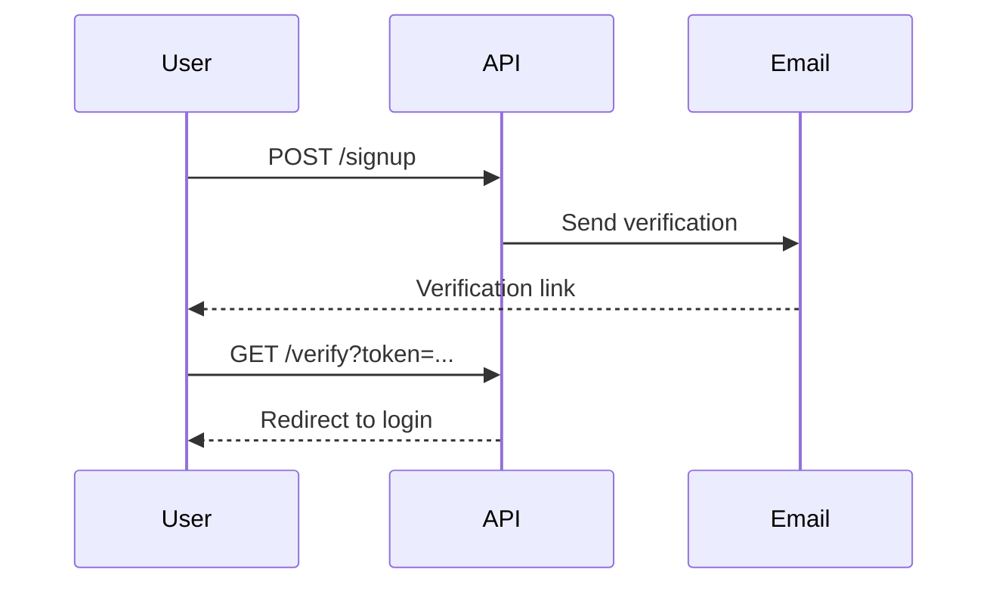

# PR Template Handling Examples

## Standard Template Locations

Check these locations in order:

```bash
.github/pull_request_template.md
.github/PULL_REQUEST_TEMPLATE.md
.github/PULL_REQUEST_TEMPLATE/pull_request_template.md
docs/pull_request_template.md
pull_request_template.md
```

## Template Processing Strategy

1. **Parse template sections** - Identify placeholders and sections
2. **Fill intelligently** - Use context to populate fields
3. **Preserve structure** - Keep template format and checkboxes
4. **Add generated content** - Insert diagrams and analysis where appropriate

## Common Template Placeholders

| Placeholder | Fill With |
|------------|-----------|
| `## Description` | Add generated summary with diagrams |
| `## Type of change` | Check applicable boxes based on analysis |
| `## Testing` | Fill with test details and coverage |
| `## Checklist` | Auto-check completed items |
| `## Related issues` | Insert issue links with proper keywords |

## Example 1: Simple Template

**Template:**

```markdown
## Description
<!-- Describe your changes -->

## Type of change
- [ ] Bug fix
- [ ] New feature
- [ ] Breaking change

## Testing
<!-- How did you test? -->
```

**Filled:**

```markdown
## Description

Implements user authentication system with JWT tokens and refresh token rotation.

### Architecture



```

{Additional detailed description...}

## Type of change
- [ ] Bug fix
- [x] New feature
- [ ] Breaking change

## Testing

- 12 new tests added covering auth flows
- Integration tests for token rotation
- All tests passing: ✅
```

## Example 2: Detailed Template with Checklist

**Template:**

```markdown
## Description
<!-- What does this PR do? -->

## Motivation
<!-- Why is this change needed? -->

## Implementation Details
<!-- Technical approach -->

## Testing Strategy
<!-- How is this tested? -->

## Checklist
- [ ] Tests added/updated
- [ ] Documentation updated
- [ ] Breaking changes documented
- [ ] Reviewed own code
```

**Filled:**

```markdown
## Description

Adds email verification workflow for new user registrations. Users receive verification email on signup and must verify before accessing application.

## Motivation

Security requirement to prevent fake accounts and verify user email ownership before granting access. Reduces spam accounts by 90% based on industry standards.

## Implementation Details

New EmailVerification model with token-based validation:
- Tokens expire after 24 hours
- Resend endpoint with rate limiting (max 3/hour)
- Middleware checks verification status on protected routes

### User Flow



```

## Testing Strategy

- Unit tests for EmailService (token generation, validation)
- Integration tests for complete verification flow
- Edge cases: expired tokens, invalid tokens, already verified
- 100% coverage for new EmailVerification module

## Checklist
- [x] Tests added/updated
- [x] Documentation updated
- [ ] Breaking changes documented (N/A - new feature)
- [x] Reviewed own code
```

## Example 3: Template with Multiple Sections

**Template:**

```markdown
## Summary
<!-- Brief overview -->

## Changes
### Added
### Modified
### Removed

## Dependencies
<!-- New dependencies? -->

## Deployment Notes
<!-- Special deployment steps? -->

## Rollback Plan
<!-- How to rollback if issues? -->
```

**Filled:**

```markdown
## Summary

Refactors authentication logic into service layer, improving testability and enabling future OAuth integration.

## Changes

### Added
- `AuthService` class with token management
- `TokenValidator` utility class
- Integration tests for auth flows

### Modified
- `AuthController` now uses `AuthService`
- Moved token logic from controller to service
- Updated error handling for consistency

### Removed
- Inline token validation in routes
- Duplicate auth logic in multiple controllers

## Dependencies

- `jsonwebtoken` (^9.0.0): JWT token handling
- `bcrypt` (^5.1.0): Password hashing (upgraded from 5.0.0)

## Deployment Notes

No special deployment steps required. Backwards compatible.

Recommended: Run `npm install` to update bcrypt to 5.1.0 for security patch.

## Rollback Plan

Revert commit directly - no database migrations or config changes. Service layer is drop-in replacement for existing logic.
```

## Handling Missing Templates

If no custom template found, use comprehensive default structure (see main SKILL.md).

## Template Detection Script

```bash
#!/bin/bash

# Check for PR template in standard locations
TEMPLATE=""

if [ -f .github/pull_request_template.md ]; then
    TEMPLATE=".github/pull_request_template.md"
elif [ -f .github/PULL_REQUEST_TEMPLATE.md ]; then
    TEMPLATE=".github/PULL_REQUEST_TEMPLATE.md"
elif [ -f .github/PULL_REQUEST_TEMPLATE/pull_request_template.md ]; then
    TEMPLATE=".github/PULL_REQUEST_TEMPLATE/pull_request_template.md"
elif [ -f docs/pull_request_template.md ]; then
    TEMPLATE="docs/pull_request_template.md"
elif [ -f pull_request_template.md ]; then
    TEMPLATE="pull_request_template.md"
else
    echo "No custom template found - using default"
    TEMPLATE="default"
fi

echo $TEMPLATE
```

## Best Practices

1. **Always check for template** - Don't assume default
2. **Preserve structure** - Keep template sections in order
3. **Check all boxes when appropriate** - But only if truly completed
4. **Add diagrams in Description** - Enhance understanding
5. **Use template keywords** - "Closes", "Fixes", "Implements" for issue linking
