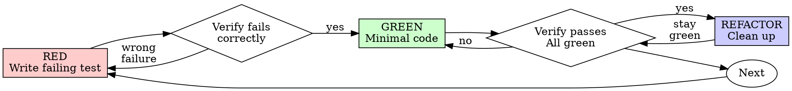

# Test-Driven Development (TDD)

## Overview

Write the test first. Watch it fail. Write minimal code to pass.

**Core principle:** If you didn't watch the test fail, you don't know if it tests the right thing.

**Violating the letter of the rules is violating the spirit of the rules.**

**Related:** For comprehensive guidance on writing effective tests, see `Skill(devkit:writing-tests)` which covers:

- AAA structure, test naming, behavior vs implementation
- Test levels strategy (unit/integration/e2e) and avoiding duplication
- Coverage and complexity guidelines
- Mocking best practices and anti-patterns

## When to Use

**Always:**

- New features
- Bug fixes
- Refactoring
- Behavior changes

**Exceptions (ask your human partner):**

- Throwaway prototypes (deleted immediately)
- Generated code (linter/formatter configs)
- Configuration files (JSON/YAML/TOML)

## The Iron Law

```
NO PRODUCTION CODE WITHOUT A FAILING TEST FIRST
```

Write code before the test? Delete it. Start over.

**Delete means delete:**

- Keep nothing as "reference"
- Adapt nothing while writing tests
- Look at nothing from before
- Delete completely

Implement fresh from tests.

## Red-Green-Refactor



### RED - Write Failing Test

Write one minimal test showing what should happen.

<Good>
```typescript
test('retries failed operations 3 times', async () => {
  let attempts = 0;
  const operation = () => {
    attempts++;
    if (attempts < 3) throw new Error('fail');
    return 'success';
  };

  const result = await retryOperation(operation);

  expect(result).toBe('success');
  expect(attempts).toBe(3);
});

```
Clear name, tests real behavior, one thing
</Good>

<Bad>
```typescript
test('retry works', async () => {
  const mock = jest.fn()
    .mockRejectedValueOnce(new Error())
    .mockRejectedValueOnce(new Error())
    .mockResolvedValueOnce('success');
  await retryOperation(mock);
  expect(mock).toHaveBeenCalledTimes(3);
});
```

Vague name, tests mock not code
</Bad>

**Requirements:**

- One behavior
- Clear name
- Real code (no mocks unless unavoidable)

### Verify RED - Watch It Fail (MANDATORY CHECKPOINT)

**MANDATORY. Never skip. This is a gate - you cannot proceed without completing it.**

```bash
# Run the test and capture output
just test path/to/test.test.ts 2>&1 | tee .tdd-red-phase.log

# Verify the log shows failure (not error, not pass)
grep -E "(FAIL|failed|failing|✗|×)" .tdd-red-phase.log
```

**RED Phase Checkpoint Requirements:**

1. **Run the test** - Execute the test you just wrote
2. **Capture failure output** - Save to `.tdd-red-phase.log`
3. **Verify correct failure** - Confirm test fails because feature is missing (not typos/errors)
4. **Document the failure** - Report the failure message before proceeding

**Report format (REQUIRED before proceeding to GREEN):**

```markdown
## RED Phase Complete ✓

**Test file:** path/to/test.test.ts
**Test name:** "should do expected behavior"
**Failure output:**
```
FAIL path/to/test.test.ts
  ✗ should do expected behavior
    Expected: <expected value>
    Received: undefined (or error message)
```
**Failure reason:** Feature not implemented yet (correct RED state)
```

**Confirm:**

- Test fails (not errors)
- Failure message matches expected behavior
- Fails because feature missing (not typos)

**Test passes immediately?** You're testing existing behavior. Fix or delete test.

**Test errors (syntax, import)?** Fix error, re-run until it fails correctly.

**CANNOT proceed to GREEN without documenting RED phase completion.**

### GREEN - Minimal Code

Write simplest code to pass the test.

<Good>
```typescript
async function retryOperation<T>(fn: () => Promise<T>): Promise<T> {
  for (let i = 0; i < 3; i++) {
    try {
      return await fn();
    } catch (e) {
      if (i === 2) throw e;
    }
  }
  throw new Error('unreachable');
}
```
Just enough to pass
</Good>

<Bad>
```typescript
async function retryOperation<T>(
  fn: () => Promise<T>,
  options?: {
    maxRetries?: number;
    backoff?: 'linear' | 'exponential';
    onRetry?: (attempt: number) => void;
  }
): Promise<T> {
  // YAGNI
}
```
Over-engineered
</Bad>

Add no features, refactor no other code, improve nothing beyond the test.

### Verify GREEN - Watch It Pass

**MANDATORY.**

```bash
just test path/to/test.test.ts
```

Confirm:

- Test passes
- Other tests still pass
- Output pristine (no errors, warnings)

**Test fails?** Fix code, not test.

**Other tests fail?** Fix now.

### REFACTOR - Clean Up

**Only after green. Never when tests are red.**

#### When to Refactor

Check for these code smells:

**Duplication:**

- [ ] Duplicated code -> Extract Method
- [ ] Magic numbers -> Named Constant
- [ ] Duplicated conditionals -> Extract Method or Polymorphism

**Size:**

- [ ] Long method (>20 lines) -> Extract Method
- [ ] Large class (>300 lines) -> Extract Class
- [ ] Long parameter list (>3 params) -> Parameter Object

**Clarity:**

- [ ] Comments explaining what -> Rename Method/Variable
- [ ] Unclear names -> Rename (use IDE)
- [ ] Complex conditionals -> Decompose Conditional

**Responsibility:**

- [ ] Feature envy -> Move Method
- [ ] Class changes for multiple reasons -> Extract Class
- [ ] Data clumps -> Parameter Object or Extract Class

**See `resources/refactoring.md` for complete catalog of smells and patterns**

#### Refactoring Process

1. **Ensure all tests green** (prerequisite - never refactor when red)
2. **One small change at a time** (one smell, one pattern)
3. **Run tests after each change** (must stay green)
4. **Commit each successful refactoring** (small, focused commits)
5. **If tests fail -> REVERT immediately** (don't try to fix, start over smaller)

#### Safe Refactorings (Use IDE)

Modern IDEs provide automated refactorings - always prefer these:

- **Rename** variable/method/class (F2 in most IDEs)
- **Extract Method/Function** (select code -> refactor menu)
- **Move** method/class to another file
- **Inline** variable/method
- **Change Signature** add/remove/reorder parameters

#### Manual Refactorings

For complex refactorings not supported by IDE:

- Extract Class
- Replace Conditional with Polymorphism
- Introduce Parameter Object
- Move Method to another class

**Process for manual refactoring:**

1. Make one tiny structural change
2. Run all tests
3. Commit if green, revert if red
4. Repeat until refactoring complete

**See `REFACTORING.md` for step-by-step guides**

#### What NOT to Do

- NO: Refactor and add features simultaneously
- NO: Continue refactoring when tests fail
- NO: Fix failing tests by changing assertions
- NO: Skip running tests "because it's obvious"
- NO: Make multiple changes before running tests
- NO: Add behavior during refactoring

#### Remember

- **Refactoring** = change structure, keep behavior
- **Tests prove** behavior is unchanged
- **Small steps** are safer than big leaps
- **IDE refactorings** are safer than manual
- **When tests fail** -> revert and try smaller
- **Commit often** -> one refactoring per commit

**For detailed refactoring patterns, see:** `REFACTORING.md`

### Repeat

Next failing test for next feature.

## Good Tests

| Quality | Good | Bad |
|---------|------|-----|
| **Minimal** | One thing. "and" in name? Split it. | `test('validates email and domain and whitespace')` |
| **Clear** | Name describes behavior | `test('test1')` |
| **Shows intent** | Demonstrates desired API | Obscures what code should do |

## Why Test-First Matters

**Test-first ensures tests actually work:**

- You see the test fail (proves it tests something)
- You test behavior (not implementation details)
- You discover edge cases while designing (not after shipping)
- Tests run identically every time (not ad-hoc manual testing)

## Red Flags - Restart with TDD

**You violated TDD if:**

- Wrote code before test
- Test passes immediately (didn't see it fail)
- Can't explain why test failed
- Kept implementation code as "reference"
- Added tests after implementing

**Action:** Delete implementation code. Start over with failing test first.

## Verification Checklist

Before marking work complete:

- [ ] Every new function/method has a test
- [ ] Watched each test fail before implementing
- [ ] Each test failed for expected reason (feature missing, not typo)
- [ ] Wrote minimal code to pass each test
- [ ] All tests pass
- [ ] Output pristine (no errors, warnings)
- [ ] Tests use real code (mocks only if unavoidable)
- [ ] Edge cases and errors covered

Can't check all boxes? You skipped TDD. Start over.

## When Stuck

| Problem | Solution |
|---------|----------|
| Cannot test | Write wished-for API. Write assertion first. Ask your human partner. |
| Test too complicated | Design too complicated. Simplify interface. |
| Must mock everything | Code too coupled. Use dependency injection. |
| Test setup huge | Extract helpers. Still complex? Simplify design. |

## Debugging Integration

Bug found? Write failing test reproducing it. Follow TDD cycle. Test proves fix and prevents regression.

Never fix bugs without a test.

## Final Rule

```
Production code -> test exists and failed first
Otherwise -> not TDD
```

No exceptions without your human partner's permission.

## Additional Resources

- **resources/refactoring.md** - Complete catalog of code smells, refactoring patterns, and step-by-step guides
- **resources/tdd-examples.md** - Extended examples including bug fixes and feature implementation
- **Skill(devkit:writing-tests)** - Comprehensive guide to writing effective tests (AAA structure, test levels, mocking, coverage)
